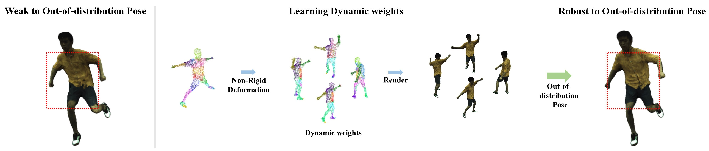

# AvatarMoE: Decomposing Non-Rigid Deformation with Part-Aware Experts for 3DGS Avatars

### [Paper](https://doi.org/10.1016/j.cag.2026.104597) | [Project Page](TODO)

**Hyeri Yang, Junyoung Hong, Shinwoong Kim, Kyungjae Lee**  
*Computers & Graphics, 2026*

<p align="center">
  
</p>

AvatarMoE is a part-aware Mixture-of-Experts framework for animatable 3D Gaussian Splatting avatars.  
The method decomposes non-rigid deformation into lightweight expert networks with dynamic GMM-based gating.

---

# Installation

Tested environment:

- Ubuntu 22.04
- Python 3.10
- PyTorch 2.1.2 + CUDA 11.8
- RTX 4090 (24 GB)

Clone the repository:

```bash
git clone --recursive https://github.com/milab-yongin/AvatarMoE.git
cd AvatarMoE
```

Create environment:

```bash
conda env create -f environment.yml
conda activate avatarmoe
```

Install CUDA extensions:

```bash
pip install submodules/diff-gaussian-rasterization
pip install submodules/simple-knn
```

---

# Dataset Preparation

We directly follow the preprocessing protocol of:

- 3DGS-Avatar: https://github.com/mikeqzy/3dgs-avatar-release
- ARAH: https://github.com/taconite/arah-release

Please prepare datasets using their official instructions first.

We evaluate on:

- ZJU-MoCap: `377, 386, 387, 392, 393, 394`
- People-Snapshot:
  `female-3-casual, female-4-casual, male-3-casual, male-4-casual`

OOD pose sequences are obtained from:
- 3DGS-Avatar
- GART

---

# SMPL Models

Download SMPL models manually from:

- https://smpl.is.tue.mpg.de/
- https://smplify.is.tue.mpg.de/

Expected structure:

```text
body_models/
└── smpl/
    ├── male/model.pkl
    ├── female/model.pkl
    └── neutral/model.pkl
```

Extract auxiliary parameters:

```bash
python extract_smpl_parameters.py
```

---

# Training

Quick start:

```bash
# ZJU-MoCap
bash run_script/zju/run_377.sh

# Refined ZJU-MoCap
bash run_script/zju_ref/run_377.sh

# People-Snapshot
bash run_script/pps/run_f3c.sh
```

Manual training:

```bash
python train.py dataset=zjumocap_377_mono
python train.py dataset=zjumocap_377_refine
python train.py dataset=ps_female_3
```

---

# Evaluation

Novel view synthesis:

```bash
python render.py mode=test dataset.test_mode=view dataset=zjumocap_377_mono
```

<!-- Novel pose synthesis:

```bash
python render.py mode=test dataset.test_mode=pose dataset=zjumocap_377_refine
``` -->

OOD poses:

```bash
python render.py mode=predict dataset.predict_seq=0 dataset=zjumocap_377_mono
```

---

# Main Files

```text
models/non_rigid.py     # AvatarMoE deformation model
train.py                # Training
render.py               # Evaluation / rendering
configs/                # Hydra configs
run_script/             # Training scripts
```

The core contribution is implemented in `models/non_rigid.py`.

---

# Acknowledgement

This project is built upon:

- 3D Gaussian Splatting
- 3DGS-Avatar
- ARAH
- smplx
- Anim-NeRF
- GART

We thank the authors for releasing their code and datasets.

---

# Citation

```bibtex
@article{yang2026avatarmoe,
  title   = {AvatarMoE: Decomposing non-rigid deformation with part-aware experts for 3DGS avatars},
  author  = {Yang, Hyeri and Hong, Junyoung and Kim, Shinwoong and Lee, Kyungjae},
  journal = {Computers \& Graphics},
  year    = {2026},
  doi     = {10.1016/j.cag.2026.104597}
}
```

---

# License


This project is released under the MIT License.

Some third-party dependencies and submodules may be subject to
their own respective licenses. Please refer to the corresponding
repositories for details.

See `LICENSE` for details.
